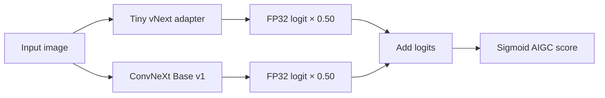

# Robust AIGC Image Detector

[](https://github.com/liaboveall/AIGC-Detector/actions/workflows/ci.yml)
[](https://github.com/liaboveall/AIGC-Detector/releases/latest)
[](LICENSE)

A degradation-aware AI-generated-image detector built for TikTok TechJam 2026
Track 5. It produces a continuous AIGC score and is evaluated under JPEG,
Gaussian blur, resizing, additive noise, color shifts, and cropping.

## Latest release

[`v2.0.0`](https://github.com/liaboveall/AIGC-Detector/releases/tag/v2.0.0)
freezes Ensemble vNext, a fixed equal-weight blend of two complementary models:

```text
score = sigmoid(0.50 * Tiny-vNext-logit + 0.50 * Base-v1-logit)
```

- Checkpoint: `weights/aigc-detector-ensemble-vnext.pt`
- SHA-256: `DE3C8C6E44C445278D6A47A9BC7F9E96B3CC9D02EFA675587F6329D46148587A`
- Size: 462,558,035 bytes
- Parameters: 115,585,507 total; 0 trainable at inference
- Input: RGB images transformed to 224 × 224
- Output: one finite score in `[0, 1]`; higher means more likely AI-generated
- Binary threshold: none newly validated for this ensemble

The checkpoint is self-contained: both member states, their source hashes, and the
fixed blend weight are embedded in one file.



## Results

These are internal development results, not an official hidden-test score.

### Historical 12,000-image selection anchor

The unchanged 16-condition Tiny-relative gates selected `alpha=0.50`. Alpha `0.60`
was rejected because its SID_Set scale-family drop was `0.005079`, beyond the
frozen `0.005000` limit.

| Metric | Tiny vNext | Ensemble vNext | Delta |
|---|---:|---:|---:|
| Robust score | 0.944886 | **0.978314** | **+0.033429** |
| Clean AUC | 0.972336 | **0.991032** | +0.018696 |
| Mean degraded AUC | 0.952022 | **0.982465** | +0.030443 |
| Worst degraded AUC | 0.916339 | **0.961712** | +0.045373 |
| CommunityForensics robust score | 0.935609 | **0.985517** | +0.049909 |
| GenImage robust score | 0.918252 | **0.960966** | +0.042714 |
| SID_Set robust score | 0.958064 | **0.967631** | +0.009568 |

### Source-disjoint modern development set

The frozen alpha was then evaluated once on 12,896 images under all 16 conditions.

| Metric | Tiny vNext | Ensemble vNext | Delta |
|---|---:|---:|---:|
| Global robust score | 0.740077 | **0.901913** | **+0.161836** |
| Clean AUC | 0.850770 | **0.958501** | +0.107731 |
| Generator-macro robust score | 0.718331 | **0.894738** | **+0.176407** |
| Worst-generator robust score | 0.548970 | **0.796370** | +0.247400 |
| Worst generator-condition AUC | 0.322516 | **0.648097** | +0.325581 |

All 16 global condition AUCs improved. A 1,000-replicate content-group bootstrap
placed the generator-macro gain 95% interval at `[0.171015, 0.182232]`. The complete
machine-readable evidence is in
[`reports/ensemble_vnext/`](reports/ensemble_vnext/README.md).

### Evidence boundary

The historical confirmation split and WildFake were consumed during earlier project
stages. They were not reopened for fusion selection, calibration, threshold tuning,
or a new sealed-performance claim. Use the continuous score unless an independent,
target-domain calibration set is available.

## Quick start

Python 3.14.7 and the pinned dependencies in `requirements.txt` were used for the
final CPU and CUDA verification.

```powershell
git clone https://github.com/liaboveall/AIGC-Detector.git
cd AIGC-Detector
git lfs pull

python -m venv .venv
.\.venv\Scripts\Activate.ps1
python -m pip install --upgrade pip
python -m pip install -r requirements.txt
```

On macOS or Linux, activate the environment with `source .venv/bin/activate`. If Git
LFS is unavailable, download the checkpoint directly from the
[`v2.0.0` release](https://github.com/liaboveall/AIGC-Detector/releases/tag/v2.0.0)
and place it under `weights/`.

Run recursive directory inference:

```powershell
python predict.py --input-dir path/to/images --output predictions.json
```

Use `--device cpu`, `--device cuda`, or `--device cuda:0` to override automatic
device selection. The output contract is exactly:

```json
[
  {"image_path": "subfolder/example.jpg", "pred": 0.9731}
]
```

Unreadable supported files receive the neutral score `0.5` instead of terminating
the batch. Scores are model estimates, not authenticity certificates.

## Verify the release

```powershell
Get-FileHash weights/aigc-detector-ensemble-vnext.pt -Algorithm SHA256
python test.py
python scripts/verify_ensemble_release.py --device cpu
python scripts/verify_ensemble_release.py --device cuda
python -m compileall -q src scripts train.py train_adapter.py `
  train_base_v3.py train_repair_adapter.py train_replay_distill.py `
  evaluate.py predict.py test.py
python -m pip check
```

The release verifier checks the artifact digest, fixed alpha, source hashes, parameter
count, frozen parameters, deterministic repeated inference, exact JSON keys, finite
scores, unreadable-image fallback, and CPU/CUDA execution.

## Reproduce the package

The release file can be rebuilt from the two hash-pinned source checkpoints:

```powershell
python scripts/package_ensemble_checkpoint.py `
  --checkpoint-a outputs/tiny_vnext/final_candidate/tiny_vnext_seed2026_gain1p60.pt `
  --checkpoint-b outputs/base_v1/primary/best.pt `
  --alpha 0.50 `
  --output weights/aigc-detector-ensemble-vnext.pt
```

The source checkpoints are not redistributed separately. Training and full benchmark
reproduction require the upstream datasets and local manifests described in
[`Dataset/README_DATASET.md`](Dataset/README_DATASET.md). Dataset image bodies and
private per-image predictions are intentionally excluded from Git.

## Limitations and responsible use

- Strong additive noise is the weakest global modern condition.
- Midjourney v1/v2 under `noise_0.05` is the weakest evaluated generator-condition
  pair; Midjourney v6 has the lowest generator-level robust score.
- The two-network ensemble increases latency, memory demand, and artifact size.
- Paired RTX 4080 Laptop measurements: 13.87 ms/image at batch 1 and 92.88 ms/batch
  at batch 32, 2.77× and 3.37× Tiny vNext latency respectively.
- Scores can reflect content, codec, camera, and semantic shortcuts and can fail on
  unseen generators, editing pipelines, regions, or content categories.
- Do not use the score as proof of authorship, fraud, or misconduct. Consequential
  decisions require human review and independent target-domain validation.
- No state-of-the-art, universal-generator, leaderboard, or competition-winning claim
  is made without an official hidden evaluation.

## Repository guide

| Path | Purpose |
|---|---|
| [`predict.py`](predict.py) | Recursive directory-to-JSON inference |
| [`evaluate.py`](evaluate.py) | Deterministic robustness evaluation |
| [`MODEL_CARD.md`](MODEL_CARD.md) | Architecture, intended use, evidence, and risks |
| [`docs/ROBUSTNESS_SUMMARY.md`](docs/ROBUSTNESS_SUMMARY.md) | Validation protocol and result tables |
| [`docs/ERROR_ANALYSIS.md`](docs/ERROR_ANALYSIS.md) | Remaining failure modes and interpretation limits |
| [`docs/ENSEMBLE_VNEXT.md`](docs/ENSEMBLE_VNEXT.md) | Frozen fusion decision protocol |
| [`reports/ensemble_vnext/`](reports/ensemble_vnext/README.md) | Aggregate machine-readable evidence |
| [`weights/`](weights/README.md) | Checkpoint, checksums, and download guidance |

Historical accepted and rejected development lines remain documented under
`docs/` and `reports/`; the default inference path always uses the v2.0.0 ensemble.

## License and maintenance

The repository source code is available under the [MIT License](LICENSE). Model
weights, datasets, and third-party materials are not relicensed by MIT; review
[`MODEL_USAGE_NOTICE.md`](MODEL_USAGE_NOTICE.md) and all upstream terms before use.

- Maintainer: [Li Jiaxing (`@liaboveall`)](https://github.com/liaboveall)
- Contributions: see [`CONTRIBUTING.md`](CONTRIBUTING.md)
- Security reports: see [`SECURITY.md`](SECURITY.md)
